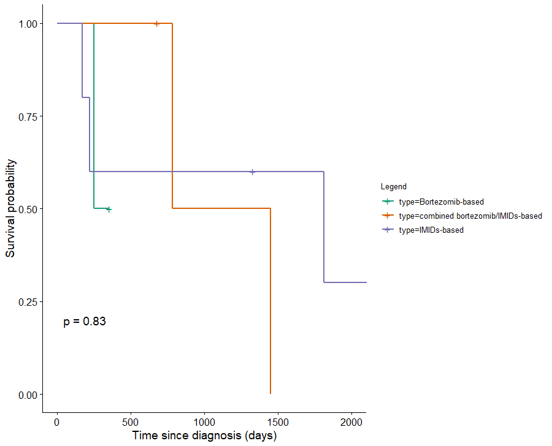

```{r setup,warning=FALSE}
library(MMRFBiolinks)
```


```{r, echo = FALSE,hide=TRUE, message=FALSE,warning=FALSE}
devtools::load_all(".")
```

```{r message=FALSE, warning=FALSE, include=FALSE}
library(TCGAbiolinks)
library(SummarizedExperiment)
library(dplyr)
library(DT)
library(png)
library(grid)
```

# Analyze data from MMRF-COMMPASS database available at GDC Data Portal 
## `MMRFGDC_prepare`

<b>Reads the data downloaded and prepare it into an R object (A summarizedExperiment or a data.frame)</b>

**Arguments** | **Description**
-----|-----
query|A query for GDCquery function
save|Save result as RData object it it is TRUE
save.filename|Name of the file to be save if empty an automatic will be created 
directory|Directory/Folder where the data was downloaded. Default: GDCdata
summarizedExperiment|Create a summarizedExperiment if it is TRUE (Default TRUE)
remove.files.prepared|Remove the files read if it is TRUE (Default FALSE). This argument will be considered only if save argument is set to true
add.gistic2.mut|If a list of genes (gene symbol) is given, columns with gistic2 results from GDAC firehose (hg19) and a column indicating if there is or not mutation in that gene (hg38) (TRUE or FALSE - use the MAF file for more information) will be added to the sample matrix in the summarized Experiment object
If mut.pipeline|If add.gistic2.mut is not NULL this field will be taken in consideration. Four separate variant calling pipelines are implemented for GDC data harmonization. Options: muse, varscan2, somaticsniper, MuTect2. For more information: https://gdc-docs.nci.nih.gov/Data/Bioinformatics_Pipelines/DNA_Seq_Variant_Calling_Pipeline/
mutant_variant_classification|List of mutant_variant_classification that will be consider a sample mutant or not. Default: "Frame_Shift_Del", "Frame_Shift_Ins", "Missense_Mutation", "Nonsense_Mutation", "Splice_Site", "In_Frame_Del", "In_Frame_Ins", "Translation_Start_Site", "Nonstop_Mutation"


Example:


```{r eval=FALSE, echo=TRUE}
# You can define a list of samples to query and download providing relative TCGA barcodes.
listSamples <- c("MMRF_2473","MMRF_2111",
                 "MMRF_2362","MMRF_1824",
                 "MMRF_1458","MRF_1361",
                 "MMRF_2203","MMRF_2762",
                 "MMRF_2680","MMRF_1797")


# Query platform Illumina HiSeq with a list of barcode 
query <- GDCquery(project = "MMRF-COMMPASS", 
                               data.category = "Transcriptome Profiling",
                               data.type = "Gene Expression Quantification",
                               experimental.strategy = "RNA-Seq",
                               workflow.type="HTSeq - FPKM",
                               barcode = listSamples)
```


```{r eval=FALSE, echo=TRUE}
# Download 
GDCdownload(query)
```


```{r eval=FALSE, echo=TRUE}
# Prepare expression matrix with geneID in the rows and samples (barcode) in the columns
MMRnaseqSE <- MMRFGDC_prepare(query,
                              save = TRUE ,
                              save.filename = "RNASeqSE.rda" ,
                              directory = "GDCdata",
                              summarizedExperiment = TRUE)
 
 
 
 

```

```{r eval=TRUE, echo=FALSE}
MMRnaseqSE<-MMRnaseqSE.filt
```

```{r eval=FALSE, echo=TRUE}
# For gene expression if you need to see a boxplot correlation and AAIC plot to define outliers you can run
MMRFdataPrepro <- TCGAanalyze_Preprocessing(MMRnaseqSE)

```

```{r eval=TRUE, echo=FALSE}
MMRFdataPrepro<-MMRFdataPrepro.filt
```


```{r, echo=FALSE, out.width='80%', fig.align='center', fig.cap='Preprocessing Output'}
knitr::include_graphics('img/PreprocessingOutput.png')
```


```{r eval=FALSE, echo=TRUE}
MMRFclin <- MMRFqueryGDC_clinic(type = "clinical")
```


```{r eval=TRUE, echo=FALSE}
MMRFclin<-clin.mm
```

```{r results='hide', echo=TRUE, message=FALSE, warning=FALSE}

#MMRnaseqSE is a matrix of Gene expression (genes in rows, samples in cols) from MMRFGDC_prepare
tokenStop<- 1
tabSurvKMcomplete <- NULL
for( i in 1: round(nrow(MMRFdataPrepro)/500)){
    message( paste( i, "of ", round(nrow(MMRFdataPrepro)/100)))
    tokenStart <- tokenStop
    tokenStop <-100*i
    tabSurvKM <- TCGAanalyze_SurvivalKM (MMRFclin,
                                         MMRFdataPrepro,
                                         Genelist = rownames(MMRFdataPrepro)[tokenStart:tokenStop],
                                        Survresult = F,ThreshTop=0.76,ThreshDown=0.33)
    tabSurvKMcomplete <- rbind(tabSurvKMcomplete,tabSurvKM)
}
tabSurvKMcomplete <- tabSurvKMcomplete[tabSurvKMcomplete$pvalue < 0.01,]
```

```{r  echo=TRUE, message=FALSE, warning=FALSE}
tabSurvKMcomplete %>% datatable(options = list(scrollX = TRUE, keys = TRUE))
```


# Analyze data from MMRF-COMMPASS database available at MMRF-CoMMpass Researcher Gateway

You can easily analyze data using following functions:

## MMRFRG_GetBorPlot
draws plot of the Best Overall Response to the Treatment.

The useful arguments for MMRFRG_GetBorPlot are:

**Arguments** | **Description**
-----|-----
therapyname|is a string containing the list of therapy for filtering data
treat.resp|is a data.frame of clinical information downloaded from MMRF-Commpass Researcher Gateway
topN|is the top number of case count that the user want to deal 
dpi|is the figure dpi 
filename|is the name of png file
width|is the image width
height|is the image height


Examples:


```{r, eval = FALSE, echo=TRUE}
MMRFRG_GetBorPlot(clinMMGateway)
```


```{r, echo=FALSE, out.width='100%', fig.align='center', fig.cap='MMRFRG_GetBorPlot output'}
knitr::include_graphics('img/MMRF_TreatResp.png')
```


```{r, eval = FALSE, echo=TRUE}
MMRFRG_GetBorPlot(clinMMGateway,"Bortezomib")
```

```{r, echo=FALSE, out.width='100%', fig.align='center', fig.cap='MMRFRG_GetBorPlot output filtering by therapy name'}
knitr::include_graphics('img/MMRF_TreatRespFilt.png')
```

## `MMRFRG_TimeBorPlot`
draws plot correlating the time to Best Overall Response (BO) leveraging the BO classification


The useful arguments for MMRFRG_TimeBorPlot are:

**Arguments** | **Description**
-----|-----
ttime|is the time expressed as cycles or days
treat.resp|is a data.frame of clinical information downloaded from MMRF-Commpass Researcher Gateway
dpi|is the figure dpi 
filename|is the name of png file
width|is the image width
height|is the image height


Example:
```{r, eval = FALSE, echo=TRUE}
MMRFRG_TimeBorPlot(clinMMGateway,"Dexamethasone","days")

```

```{r, echo=FALSE, out.width='75%', fig.align='center', fig.cap='MMRFGetGateway_TimeBOresponsePlot output'}
knitr::include_graphics('img/TimeBestOverall_responsePlot_1.png')
```


## `MMRFRG_TreatBorDurationPlot`
draws plot of Treatment duration (cycle/days) for the Best Overall Response filtered by Therapy classification.

**Arguments** | **Description**
-----|-----
therapyname|is a string containing the therapy for filtering data
ttime|is the time expressed as cycles or days
treat.resp|is a data.frame of clinical information downloaded from MMRF-Commpass Researcher Gateway
line|is a string containing the line of therapy 
bor| is a string containing the type of BO Response (e.g.'Partial Response','Complete Response', etc. )
dpi|is the figure dpi 
filename|is the name of png file
width|is the image width
height|is the image height


Example:


```{r, eval = FALSE, echo=TRUE}
MMRFRG_TreatBorDurationPlot(clinMMGateway,"Bortezomib",ttime="cycles",bor="PR",height=10, width=10)
```

```{r, echo=FALSE, out.width='80%', fig.align='center', fig.cap='MMRFRG_TreatBorDurationPlot output ("Partial Response in this case) '}
knitr::include_graphics('img/Trt_DurationPlot_1.png')
```


## `MMRFRG_VariantCountPlot`
draw plot of annoteted variants by Best Overall Response and Therapy class

**Arguments** | **Description**
-----|-----
variant.ann|is the dataframe of annotated variants downloaded from MMRF-Commpass Researcher Gateway
trt|is the dataframe containing information about treatment-response downloaded from MMRF-Commpass Researcher Gateway 
treat.resp|is a data.frame of clinical information downloaded from MMRF-Commpass Researcher Gateway
filenm|is the name of the png file. If filenm is Null, the plot is draw but it is not saved.
width| Image width
height|Image height
topN|is the top number of variant count


Example:


Variant cout grouped by Best Overall Response and Treatment:
(top variant count=80)

```{r, eval = FALSE, echo=TRUE}
summary.var<-MMRFRG_VariantCountPlot(variant.ann,trt,topN=80,filenm=NULL)
```

```{r, echo=FALSE, out.width='90%', fig.align='center', fig.cap='MMRFRG_VariantCountPlot output'}
knitr::include_graphics('img/MMRFvariantCount.png')
```


## `MMRFRG_GetIDSamplebyVariant`
Filter patient information  by dbSNP variant 

**Arguments** | **Description**
-----|-----
variant|is the vector of dbSNP ID
variant.ann|is the data.frame of annotated variants downloaded from MMRF-Commpass Researcher Gateway 
treat.resp|is a data.frame of clinical information downloaded from MMRF-Commpass Researcher Gateway
patient|is the dataframe of the patient clinical data downloaded from MMRF-Commpass Researcher Gateway


Example:

Get patients having variants in "variant":

```{r, eval = FALSE, echo=TRUE}

variant <- c("rs2157615","rs61731685","rs372409204","rs111362472")

patient.var<-MMRFRG_GetIDSamplebyVariant(variant.ann,patient,variant)
```


## `MMRFRG_SurvivalKM`
Perform Survival analysis focused on patients having the before selected variants

**Arguments** | **Description**
-----|-----
patient|is the data.frame of the patient clinical data downloaded from MMRF-Commpass Researcher Gateway 
trt|is the data.frame of the patient clinical data (i.e. treatment-response) downloaded from MMRF-Commpass Researcher Gateway 
FilterBy| Column with groups to plot. This is a mandatory field.
risk.table| show or not the risk table
legend| Legend title of the figure
xlim| x axis limits e.g. xlim = c(0, 1000). Present narrower X axis, but not affect survival estimates.
main| main title of the plot
labels| labels of the plot
ylab| y axis text of the plot
xlab| x axis text of the plot
filename| The name of the pdf file.
color| Define the colors/Pallete for lines.
width| Image width
height| Image height
pvalue| show p-value of log-rank test
conf.range|  show confidence intervals for point estimates of survival curves.
dpi| Figure quality


Example:


```{r, eval = FALSE, echo=TRUE}

 MMRFRG_SurvivalKM(patient.var,
                   trt,
                   FilterBy="treatment", 
                   filename="SurvivalKM",
                   conf.range = FALSE,
                   risk.table=FALSE,
                   color = c("Dark2"))


```

```{r, echo=FALSE, out.width='99%', fig.align='center', fig.cap='MMRFRG_SurvivalKM output'}

```
