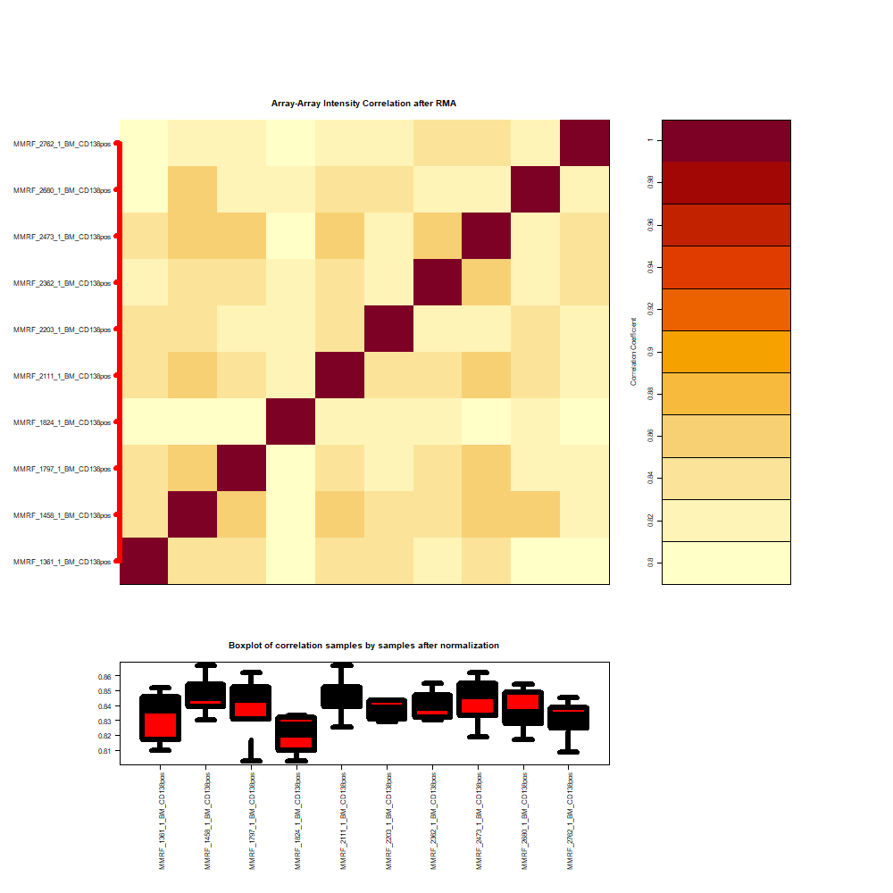
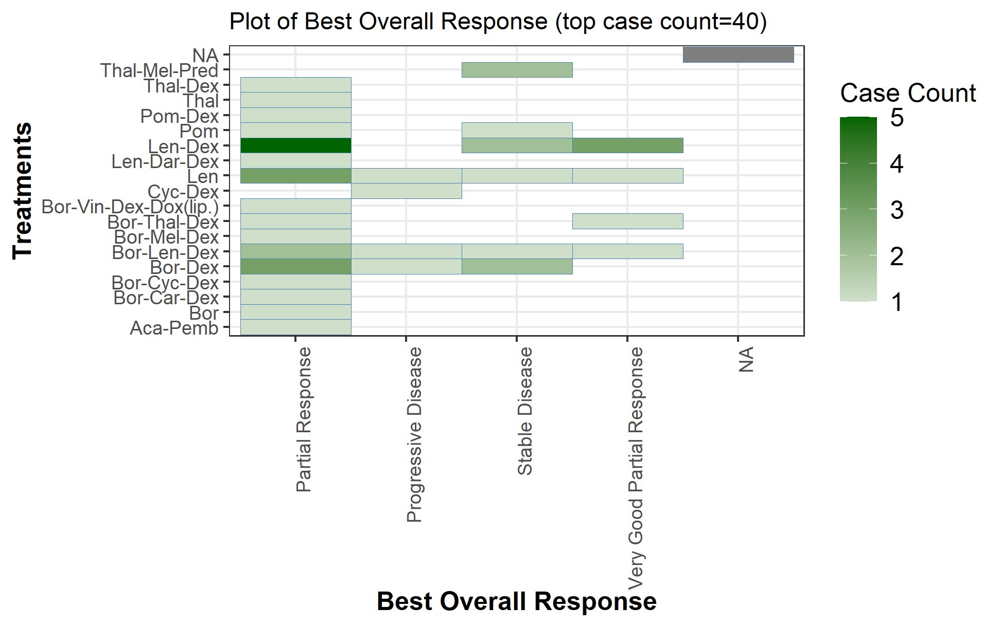
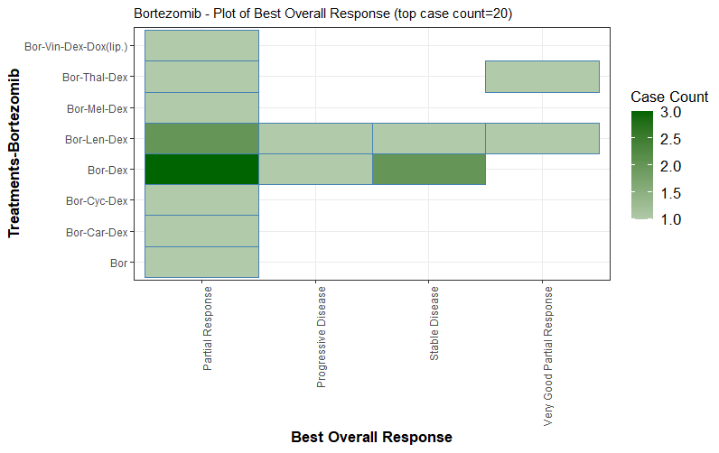
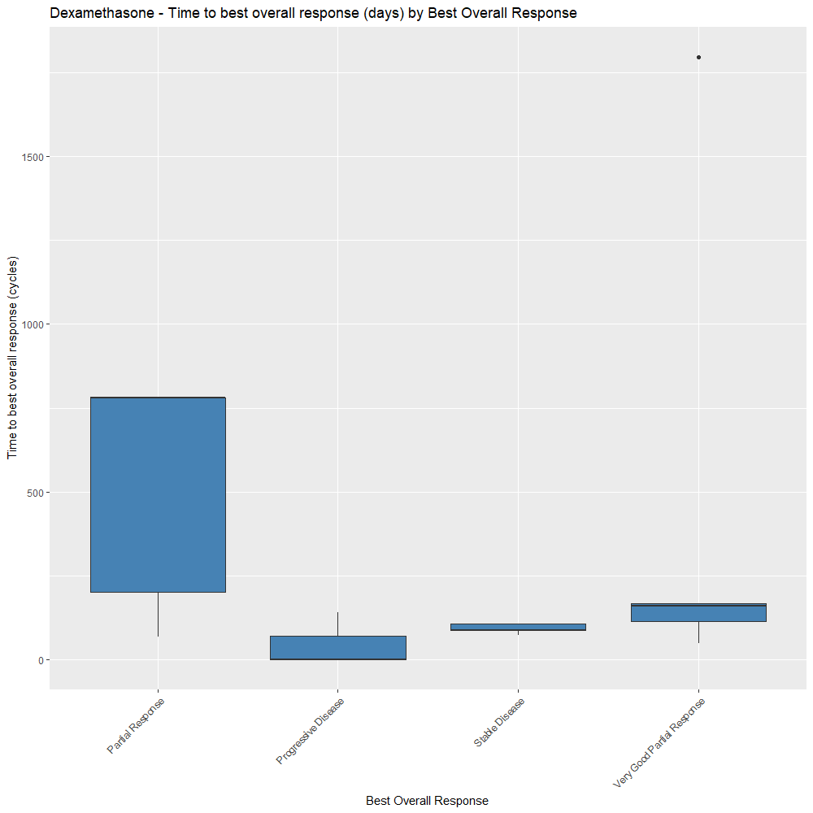
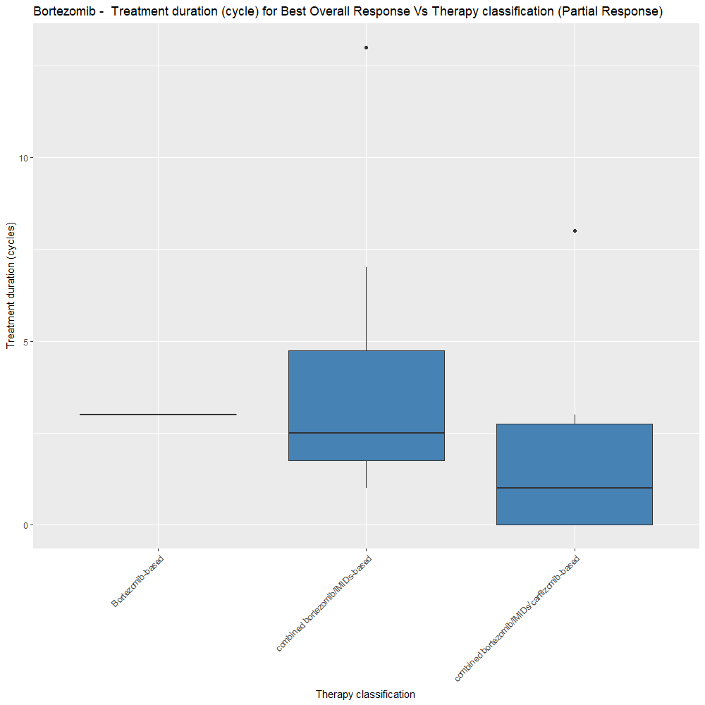

```{r setup}
library(MMRFBiolinks)
```


```{r, echo = FALSE,hide=TRUE, message=FALSE,warning=FALSE}
devtools::load_all(".")
```

```{r message=FALSE, warning=FALSE, include=FALSE}
library(TCGAbiolinks)
library(SummarizedExperiment)
library(dplyr)
library(DT)
library(png)
library(grid)
```

# Analyze data from MMRF-COMMPASS database available at GDC Data Portal 
You can easily prepare data for analysis using MMRFGDC_prepare. MMRFGDC_prepare must be used  in conjuction with GDCquery, GDCdownload and TCGAanalyze_Preprocessing functions belonging to TCGABiolinks package:

## `MMRFGDC_prepare`: reads the downloaded data and prepare them into an R object for the next analysis


You can easily search TCGA samples, download and prepare a matrix of gene expression.

```{r eval=FALSE, echo=TRUE}
# You can define a list of samples to query and download providing relative TCGA barcodes.
listSamples <- c("MMRF_2473","MMRF_2111",
                 "MMRF_2362","MMRF_1824",
                 "MMRF_1458","MRF_1361",
                 "MMRF_2203","MMRF_2762",
                 "MMRF_2680","MMRF_1797")


# Query platform Illumina HiSeq with a list of barcode 
query <- GDCquery(project = "MMRF-COMMPASS", 
                  data.category = "Transcriptome Profiling",
                  data.type = "Gene Expression Quantification",
                  experimental.strategy = "RNA-Seq",
                  workflow.type="HTSeq - FPKM",
                  barcode = listSamples)
```


```{r eval=FALSE, echo=TRUE}
# Download 
GDCdownload(query)
```


```{r eval=FALSE, echo=TRUE}
# Prepare expression matrix with geneID in the rows and samples (barcode) in the columns
MMRnaseqSE <- MMRFGDC_prepare(query,
                              save = TRUE ,
                              save.filename = "RNASeqSE.rda" ,
                              directory = "GDCdata",
                              summarizedExperiment = TRUE)
 
 
 
 

```

```{r eval=TRUE, echo=FALSE}
MMRnaseqSE<-MMRnaseqSE.filt
```

```{r eval=FALSE, echo=TRUE}
# For gene expression if you need to see a boxplot correlation and AAIC plot to define outliers you can run
MMRFdataPrepro <- TCGAanalyze_Preprocessing(MMRnaseqSE)

```

```{r eval=TRUE, echo=FALSE}
MMRFdataPrepro<-MMRFdataPrepro.filt
```


```{r, echo=FALSE, out.width='80%', fig.align='center', fig.cap='Preprocessing Output'}

```


## `MMRFanalyzeGDC_SurvivalKM`: Correlating gene expression and Survival Analysis


```{r eval=FALSE, echo=TRUE}
MMRFclin <- MMRFqueryGDC_clinic(type = "clinical")
```


```{r eval=TRUE, echo=FALSE}
MMRFclin<-clin.mm
```

```{r results='hide', echo=TRUE, message=FALSE, warning=FALSE}

#MMRnaseqSE is a matrix of Gene expression (genes in rows, samples in cols) from MMRFGDC_prepare
tokenStop<- 1
tabSurvKMcomplete <- NULL
for( i in 1: round(nrow(MMRFdataPrepro)/500)){
    message( paste( i, "of ", round(nrow(MMRFdataPrepro)/100)))
    tokenStart <- tokenStop
    tokenStop <-100*i
    tabSurvKM <- MMRFanalyzeGDC_SurvivalKM(MMRFclin,
                                        MMRFdataPrepro,
                                        Genelist = rownames(MMRFdataPrepro)[tokenStart:tokenStop],
                                        Survresult = F,ThreshTop=0.76,ThreshDown=0.33)
    tabSurvKMcomplete <- rbind(tabSurvKMcomplete,tabSurvKM)
}
tabSurvKMcomplete <- tabSurvKMcomplete[tabSurvKMcomplete$pvalue < 0.01,]
```

```{r  echo=TRUE, message=FALSE, warning=FALSE}
tabSurvKMcomplete %>% datatable(options = list(scrollX = TRUE, keys = TRUE))
```

# Analyze clinical data downloaded from MMRF-Commpass Researcher Gateway 
You can easily analyze data using following functions:

## `MMRFgetGateway_BestOverallResponsePlot`: draw plot of the Best Overall Response to the Treatment


```{r, eval = FALSE, echo=TRUE}
MMRFgetGateway_BestOverallResponsePlot(clinMMGateway)
```


```{r, echo=FALSE, out.width='75%', fig.align='center', fig.cap='...'}

```


```{r, eval = FALSE, echo=TRUE}
MMRFgetGateway_BestOverallResponsePlot(clinMMGateway,"Bortezomib")
```

```{r, echo=FALSE, out.width='75%', fig.align='center', fig.cap='...'}

```

## `MMRFgetGateway_TimeBestOverallResponsePlot`: Draw plot of Time Vs the Best Overall Response


```{r, eval = FALSE, echo=TRUE}
MMRFgetGateway_TimeBestOverallResponsePlot(clinMMGateway,"Dexamethasone","days")

```

```{r, echo=FALSE, out.width='75%', fig.align='center', fig.cap='Time to Best Overall Response'}

```


## `MMRFgetGateway_TrtdurationBO`: Draw plot of the Treatment duration (cycle/days)
```{r, eval = FALSE, echo=TRUE}
MMRFgetGateway_TrtdurationBO(clinMMGateway,"Bortezomib",ttime="cycles",bor="PR",height=10, width=10)
```

```{r, echo=FALSE, out.width='80%', fig.align='center', fig.cap='Treatment duration Best Overall Response (i.e. Partial Response)  by therapy classification'}

```


